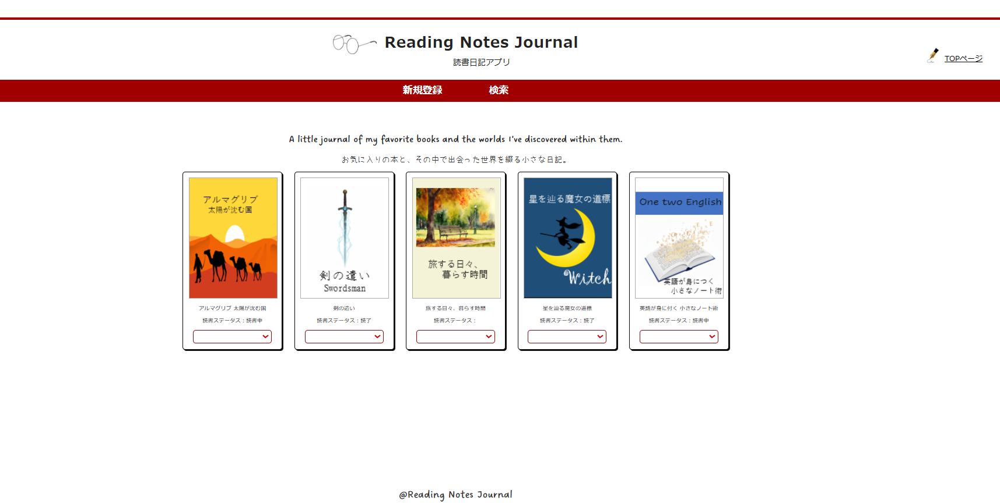
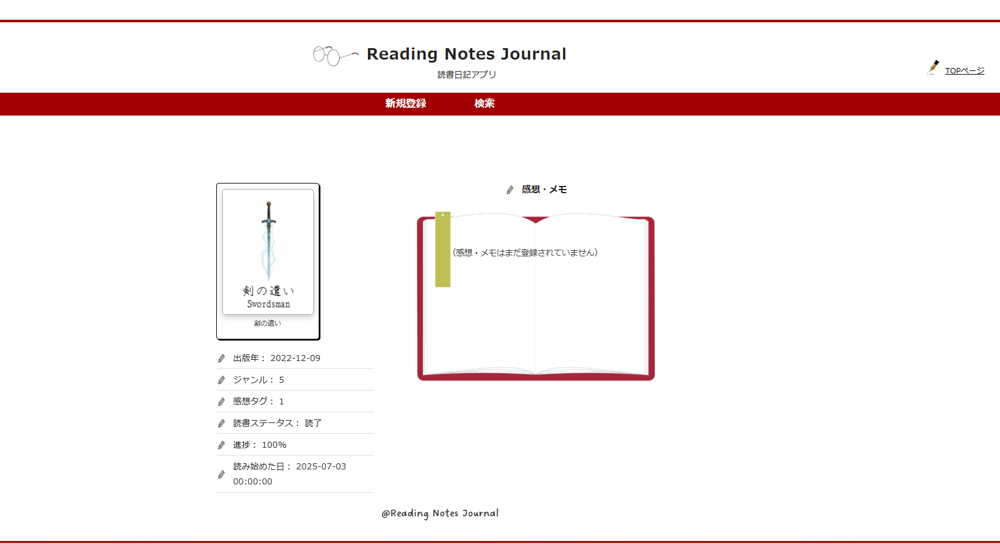
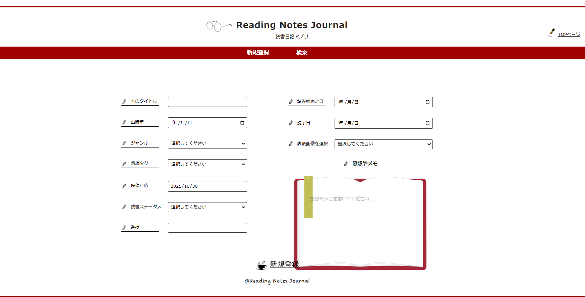

# 📚 Reading Notes Journal  
**～お気に入りの本と、その中で出会った世界を綴る小さな日記～**

Java（Servlet / JSP）と MySQL を使って作成した、**読書記録アプリ**です。  
本のタイトル・画像・感想・ジャンル・読了日などを記録し、  
自分だけの「本棚」をデジタル上に再現できます。

---

## 🌟 Features（主な機能）

- 📖 本の登録・編集・削除  
- 🖋 感想（メモ）の入力・保存  
- 🏷 感情タグ・ジャンル別の分類  
- 🖼 画像付きカードレイアウトで一覧表示（最大15冊）  
- 📅 読了日や登録日の自動記録  
- 💬 削除確認モーダルによる安全操作  
- 💡 美しいフォントとアイコンを用いた本棚デザイン  

---

## 🧰 Tech Stack（使用技術）

```
| 分類               | 使用技術           |
|------------------- |-----------|
| 言語               | Java, HTML, CSS, JavaScript |
| フレームワーク      | Servlet / JSP |
| データベース        | MySQL |
| サーバー            | Apache Tomcat |
| IDE / 環境         | Eclipse |
| その他             | JSTL, EL式, DAOパターン, MVC構成 |
```

---

## 🗂 Directory Structure（ディレクトリ構成）

```plaintext
ReadingNotesJournal/
├── src/
│   ├── servlet/           # 各画面用サーブレット（Top, Register, Edit, Delete など）
│   ├── dao/               # DBアクセス用クラス（BookDAO など）
│   └── model/             # データモデル（Book.java など）
│
├── WebContent/
│   ├── css/               # スタイルシート（fonts, colors, layouts）
│   ├── images/            # 画像ファイル（書影・アイコン類）
│   ├── WEB-INF/
│   │   ├── jspf/          # 共通パーツ（header.jspf / footer.jspf）
│   │   ├── bookDetail.jsp # 詳細ページ
│   │   ├── register.jsp   # 登録ページ
│   │   ├── edit.jsp       # 編集ページ
│   │   └── search.jsp     # 検索ページ
│   └── index.jsp          # トップページ（一覧）
│
└── README.md

```

---

## 🚀 How to Run（動作方法）

1. **MySQL** にデータベースを作成 

```sql
   CREATE DATABASE ReadingNotesJournal;
```

2.books, genres, emotions テーブルを作成

 ※ 各テーブル構造は BookDAO の SQL 参照

3.Eclipse でプロジェクトをインポート

4.Tomcat v10.1 を設定し、アプリを起動

5.ブラウザで以下のURLへアクセス 

http://localhost:8080/ReadingNotesJournal/

---

## 🖼 Screenshots（画面イメージ）


|               トップページ               |                   詳細ページ                  |                     登録ページ                    |
| :--------------------------------: | :--------------------------------------: | :------------------------------------------: |
|  |  |  |


---

## 🎨 Design Notes（デザインのこだわり）

見出しフォントに Azuki / DreamingOutloudPro / Cavolini / Gigi を使用

ナビバー上部に赤いライン（#a00000）を配置し、印象的なアクセントに

ヘッダー左に眼鏡アイコン、右に万年筆アイコンを配置

本カードは 5×3 のグリッドで整列

下部にティーカップ画像をあしらい、柔らかい雰囲気を演出

---

## 👩‍💻 Developer

エルコルテ 智恵美（Chiemi Elcorte）
📍 福岡在住 | 💬 Java / MySQL / HTML / CSS / JavaScript 学習中

「読書を通して感じた世界を、デジタルでも大切に残したい」
そんな思いからこのアプリを制作しました。

---

## 📝 License

This project is released under the MIT License.

---

## 💡 Future Improvements（今後の開発予定）

🔐 ログイン機能の追加（複数ユーザー対応）

📱 スマートフォン対応デザイン（レスポンシブ対応）

⭐ 検索・ソート機能の強化

📊 読書統計グラフの追加

© 2025 Chiemi Elcorte. All rights reserved.

